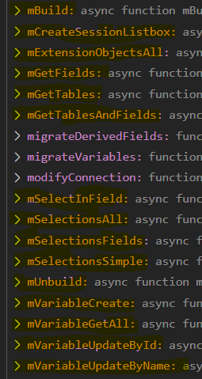

# Enigma.js Mixins

`enigma.js` functionality can be extended via [mixin](https://github.com/qlik-oss/enigma.js/blob/41c33604f7e384d0a34a502bd29e9f3db94dd9d2/docs/api.md#mixins). This repository contains set of mixins that can be added to any `enigma.js` instance. Some of the mixins are quite trivial but I've been lazy enough to remember the objects/params and decided to create these "shortcuts" :)

btw who ever made the `mixin` option available in `enigma.js` ... Thank you!

## Requirements

TBA

## Installation

This project don't include `enigma.js` itself. Make sure that `enigma.js` is installed:

> `npm install enigma.js`

Once `enigma.js` is installed, install the mixins:

> `npm install enigma-mixins`

## Init

### Browser usage

```javascript
import enigma from "enigma.js";
import schema from "enigma.js/schemas/12.20.0.json";
import enigmaMixins from "enigma-mixins";

// Create enigma session as usual
// but include the mixin property
const session = enigma.create({
  schema,
  mixins: [enigmaMixins],
  url: "ws://localhost:4848/app/engineData",
  createSocket: (url) => new WebSocket(url),
});
```

### Node JS usage

```javascript
const enigma = require("enigma.js");
const WebSocket = require("ws");
const schema = require("enigma.js/schemas/12.20.0.json");
const enigmaMixins = require("enigma-mixins");

const session = enigma.create({
  schema,
  mixins: [enigmaMixins],
  url: "ws://localhost:4848/app/engineData",
  createSocket: (url) => new WebSocket(url),
});
```

## Usage

At the moment this project includes only mixins that are extending the `enigma.js` `Doc` object. After the mixin is imported a new set of functions will be available in the `Doc` instance.

```javascript
let global = await session.open();
let qDoc = await global.openDoc("/data/Helpdesk Management.qvf");
```

After this `qDoc` will have all the mixins available



## Mixins

The available `mixin` are "grouped" in the following categories:

- Selections
- TableAndFields
- Variables
- Extensions
- Build/Unbuild

### Selections

- `mSelectionsAll` - returns the current selections (if any). This method will return all selected values (even if more than 6 values are selected)
  - no parameters
- `mSelectionsFields` - return just an array of the fields, having selections in them
  - no parameters
- `mSelectionsSimple` - returns array of `field <-> selected value`

  - `groupByField` (`optional`; default `false`) If this argument is provided the array will be grouped by field name:

    ```javascript
    [
      {field: "Field 1": values: [...]},
      {field: "Field 2": values: [...]},
      ...
    ]
    ```

- `mSelectInField` - select a value(s) in the specified field
  - field - field name
  - values - array of string values to be selected
  - toggle (`optional`; default `false`)

### TableAndFields

- `mGetTablesAndFields` - returns an object array with the field <-> table relation
  - no parameters
- `mGetTables` - returns an array with all table names
  - no parameters
- `mGetFields` - returns an array with all field names
  - no parameters
- `mCreateSessionListbox` - creates a **session** listbox object for the specified field
  - fieldName
  - type - (`optional`; default `session-listbox`) - type of the listbox

### Variables

- `mVariableGetAll` - return a list with all variables in the document

  - showSession (`optional`; default `false`)
  - showConfig (`optional`; default `false`)
  - showReserved (`optional`; default `false`)

- `mVariableUpdateById` - update existing variable by id

  - id - id of the variable, to be updated
  - definition - the expression/definition of the variable
  - comment - (`optional`)

- `mVariableUpdateByName` - update existing variable by name

  - name - name of the variable, to be updated
  - definition - the expression/definition of the variable
  - comment - (`optional`)

- `mVariableCreate` - create new variable
  - name - (`optional`; default is empty string)
  - comment (`optional`; default is empty string)
  - definition (`optional`;default is empty string)

### Extensions

- `mExtensionObjectsAll` - return a list with all extensions objects in the document
  - no parameters

### Bookmarks

- `mGetBookmarksMeta` - returns full info about all bookmarks (to which the user have access)
  - `state` (`optional`; default is `$`)
    Each row will return:
    - `layout` - layout of the Qlik object (`getLayout()`)
    - `properties` - properties of the Qlik object (`getProperties()`)
    - `setAnalysis` - raw set analysis returned from Qlik. For example: `"<state_name={'California','Minnesota','Ohio','Texas'}>"`
    - `setAnalysisDestructed` - set analysis but in more readable format. Using the example above:
      - field: `state_name`
      - type: `field` or `expression`
      - values: array of values in the bookmark.
- `mGetBookmarkMeta` - similar to `mGetBookmarksMeta` but returns the meta for only one bookmark
  - `bookmarkId`
  - `state` (`optional`; default is `$`)
- `mCreateBookmarkFromMeta` - create new bookmark using data from existing bookmark
  - `bookmarkMeta` -
  - `title` -
  - `description` (`optional`; default is empty string)
- `mGetBookmarkValues` - return the values for specific bookmark
  - `bookmarkId`
  - `state` (`optional`; default is `$`)
- `mCloneBookmark` - create new bookmark using data from existing bookmark (kinda similar to `mCreateBookmarkFromMeta`. In the near future only one of these methods will stay)
  - `sourceBookmarkId` -
  - `state` -
  - `title`
  - `description` (`optional`; default is empty string)

## Build/Unbuild

If you haven't used [corectl](https://github.com/qlik-oss/corectl) now its a good time to start :) But I've wanted to have the same/similar functionality (for building/unbuilding app) in [enigma.js](https://github.com/qlik-oss/enigma.js/blob/master/schemas/12.67.2.json) as well

### Unbuild

- `mUnbuild` - Extracts all parts of a Qlik Sense app (apart from the data itself) into JSON object. The resulted JSON object have the following format:

  - appProperties (`object`)
  - connections (`array`)
  - dimensions (`array`)
  - measures (`array`)
  - objects (`array`) - all other objects. Including sheets, charts, filters etc.
  - script (`string`)
  - variables (`array`)

The result JSON can be stored in file (or multiple files) and put under version control

### Build

- `mBuild` - Opposite to `unbuild`. Provide a JSON object with Qlik objects and this mixin will update the existing objects or, if they do not exists, it will create them. The structure of the input JSON object must be in specific format (see `unbuild`).

### **To preserve the changes the app have to be saved. The build command do not save the app automatically!**

Both `mBuild` and `mUnbuild` are throwing errors (if there are any errors of course). Because of this they need to be followed by `catch` ... just in case. For example:

```javascript
let build = await qDoc.mBuild(data).catch(function (e) {
  // do something with the error here
});
```
